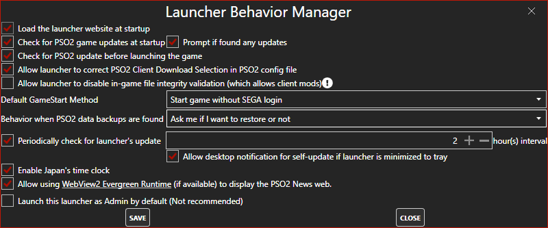
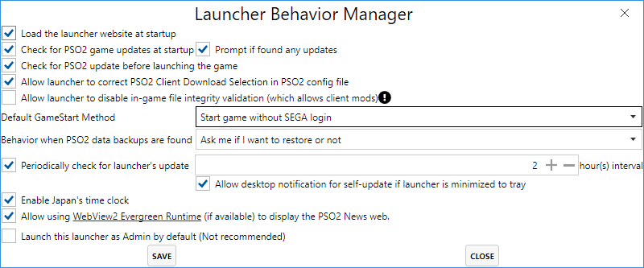
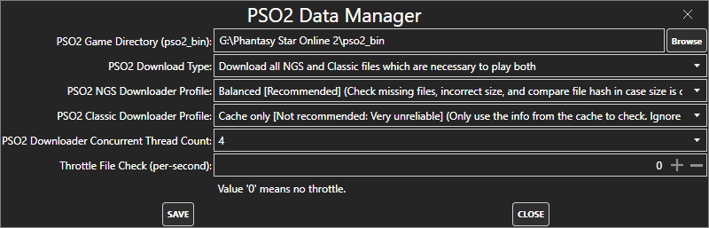

# PSO2-Launcher-CSharp
 An alternative game launcher for Phantasy Star Online 2 (JP) written in C# (.NET5).

# Feature Overviews
- All functions related to update PSO2 JP client.
  - Check for PSO2 Updates.
  - Perform game client update with some customizable settings (see the UI previews below).
- ~~Installing PSO2 JP client.~~ (This is planned)
- Launch PSO2 JP game (traditional method and new method supported):
  - Traditional method: launch game without asking for login info. Then player will login in-game.
    - This is the old way to launch PSO2 game before NGS release.
  - New method: Prompt a login with SEGA JP then use the info to launch the game.
    - If you don't trust this launcher, you shouldn't use this.
    - The login info is not persistently saved anywhere. There is an unrelated feature which will remember the login info in the memory until the launcher exits. However, this is not enabled by default. By default, the launcher will `login-and-forget` for each GameStart.
    - **You can set the default method as you desired in the `Launcher behavior manager` (preview image below).**
- Minimize to tray (or minimize to `Notification Area`, or `Windows's clock area` on the taskbar):
  - Double-click on the launcher's icon in the Notification Area to restore the launcher from tray.
  - There is a quick menu if you right-click the launcher's icon in the Notification Area. The quick menu contains quick `most used functions`:
    - Game start (using default method which is set by user).
    - Game start without SEGA login (Bypass user's setting).
    - Game start with SEGA login (Bypass user's setting).
    - Check for PSO2 updates.
- Configure PSO2 Client's options.
  - Only some NGS settings are supported in simple mode right now.
  - Classic options are planned.
  - More options are planned.

# UI Previews
| Dark theme      | Light theme     |
| :-------------: | :-------------: |
|  |  |
|  |  |
|  |  |
|  |  |
|  |  |